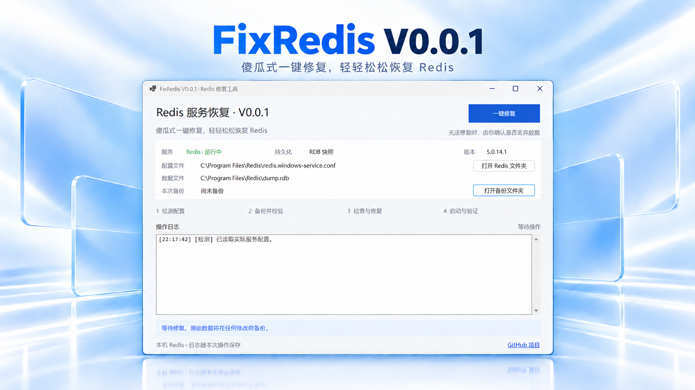

# FixRedis · Redis 服务恢复工具 `V0.0.1`

**傻瓜式一键修复，轻轻松松恢复 Redis。**

面向 **Windows Redis 5.0** 的桌面工具，重点解决 **AOF 文件损坏导致服务无法启动** 的问题。点击“一键修复”，配置识别、文件备份、检查修复和启动验证交给程序完成。

项目主页：[GitHub · peijiehuang/FixRedis](https://github.com/peijiehuang/FixRedis)



> 海报基于实际启动程序的截图制作；[查看原始界面截图](assets/screenshot.png)。`V0.0.1` 是修复工具版本，界面信息区的 Redis 版本是被修复服务的版本。

## 🌟 核心功能

- **识别真实配置**：从本机 Windows 服务 `Redis` 的启动参数读取配置、数据目录、端口及持久化方式。
- **修复前备份**：备份 RDB、AOF、配置与日志，记录原路径、文件大小和 SHA-256；副本校验失败立即停止。
- **AOF 截断修复**：在工作副本上调用配套 `redis-check-aof --fix`，复检通过后替换，保留有效前缀。
- **数据丢失确认**：无法保留数据时弹窗确认，默认拒绝；不自动切换到旧 RDB。
- **启动后验证**：核对服务状态、进程身份、配置、认证后的 PING、loading 和持久化状态。
- **实时操作反馈**：四阶段状态、日志、最终结果，以及 Redis 目录、备份目录和 GitHub 项目的快捷入口。
- **权限与互斥**：自动请求管理员提权，再检查实际权限；非管理员提示后退出，禁止重复修复和运行中关闭。

## 📦 下载与运行

在 [Releases](https://github.com/peijiehuang/FixRedis/releases) 下载 `FixRedis-v0.0.1-win-x64.exe`。程序为 Windows x64 自包含单文件，**不需要另装 .NET 运行时**。

运行环境：Windows 10/11 x64，已安装为本机服务 `Redis` 的 Windows Redis 5.0，以及安装目录内配套的 `redis-check-aof.exe`、`redis-check-rdb.exe`。

## 🚀 使用方法

1. 启动程序并允许 Windows 管理员权限请求。若收到权限提示，关闭后右键选择“以管理员身份运行”。
2. 核对界面中的配置、数据文件和持久化方式，点击“一键修复”。
3. 等待“检测配置 → 备份并校验 → 检查与修复 → 启动与验证”完成，查看日志和最终结果。
4. 若出现全部数据丢失确认，先核对故障原因和备份位置；未获得业务批准时选择“否”。

**Redis 恢复运行不代表业务数据完整。** AOF 截断可能丢失一段命令；确认空库恢复会丢失该实例全部当前数据。生产环境应由负责人决定是否允许丢弃，程序不会替你推断业务影响。

## 🔧 修复规则

| 情况 | 处理 |
| --- | --- |
| 服务正在运行且健康 | 报告无需修复，不重启、不修改数据 |
| AOF 有效或为空 | 保留文件，尝试启动并验证 |
| AOF 可保留有效前缀 | 在副本上截断、复检，再替换和启动 |
| AOF 前导区损坏、全部损坏或修复失败 | 明确说明原因；需要数据丢失确认 |
| RDB 损坏 | 检查器没有 RDB 修复能力；需要数据丢失确认 |
| 同时启用 RDB 与 AOF | 按 AOF 加载优先级处理，不回退历史 RDB |
| 权限、端口、磁盘、内存、认证等问题 | 报告失败，不通过清空数据解决 |
| 无持久化或缺少明确损坏证据 | 只尝试启动及诊断，不自动清空 |

检查工具超时为 5 分钟，启动及健康验证超时为 60 秒。不会强杀 Redis，不循环尝试，不关闭持久化或校验来绕过错误。

## 🗂️ 备份与支持范围

备份默认保存在 `%ProgramData%\FixRedis\Backups\<时间戳>-<唯一编号>`，包含 `originals/`、`manifest.json`、`operation.log` 和工作副本 `work/`。目录访问权限受限，不自动清理，也不自动恢复历史生产数据。

V0.0.1 仅支持本机 Windows Redis 5.0 独立主节点、RDB 和单文件 AOF。暂不支持 Redis 7 多文件 AOF、集群、副本、Sentinel、模块、WSL、容器、`include` 配置或命令重命名。服务启动参数必须明确指向绝对路径的程序和配置文件。

更多说明：[修复与备份说明](docs/recovery.md) · [测试和实机验收](docs/testing.md) · [更新记录](CHANGELOG.md)

## 🛠️ 项目结构与构建

| 目录 | 用途 |
| --- | --- |
| `src/FixRedis.WinForms/` | 启动与权限检查、版本信息、`Forms/` 界面 |
| `src/FixRedis.Core/` | `Abstractions/` 接口模型、`Configuration/` 配置、`Persistence/` 备份与检查、`Repair/` 编排、`Platform/` 服务、`Protocol/` 通信、`Infrastructure/` 进程与互斥 |
| `tests/FixRedis.Tests/` | `Unit/`、`Integration/`、`Service/`、`UI/`、`Support/` 分类测试 |
| `scripts/` | 本地发布、显式实机测试入口 |
| `docs/` | 修复策略、测试方式和能力边界 |
| `assets/` | README 海报和真实界面截图 |
| `.github/workflows/` | 自动构建、单元测试及版本发布 |
| `artifacts/` | 本地构建产物、备份和测试证据，**不提交 Git** |

使用 .NET 8 SDK，在根目录打开 `FixRedis.sln`，或执行：

```powershell
dotnet build FixRedis.sln -c Release
dotnet run --project tests/FixRedis.Tests -c Release --no-build -- --filter '[单元]'
./scripts/publish.ps1
```

本地发布程序位于 `artifacts/publish/win-x64/`，带版本号的发布文件位于 `artifacts/release/`。测试沿用控制台验收程序，失败返回非零退出码；请使用 `dotnet run`，不是 `dotnet test`。

已有 **17 项本机 Windows 服务实测通过** 的记录，验证了真实 AOF 启动失败、修复、键值保留及再次重启；这不表示能覆盖或修复所有 Redis 故障。直接实机测试会停止本机服务，只应在允许中断的环境中按[测试说明](docs/testing.md)执行。

## 🤖 版本与自动发布

版本统一维护在 `Directory.Build.props`：产品版本 `0.0.1`，文件及程序集版本 `0.0.1.0`，界面显示 `V0.0.1`。

[发布工作流](.github/workflows/release.yml)在推送 `v*` 标签时验证版本、运行单元测试、构建自包含程序并创建 GitHub Release。更新版本后推送对应标签：

```powershell
git tag v0.0.1
git push origin v0.0.1
```

问题反馈请提交 [Issue](https://github.com/peijiehuang/FixRedis/issues)。请先去除日志中的密码、业务数据和敏感路径；不要上传真实 RDB/AOF 或完整生产备份。
